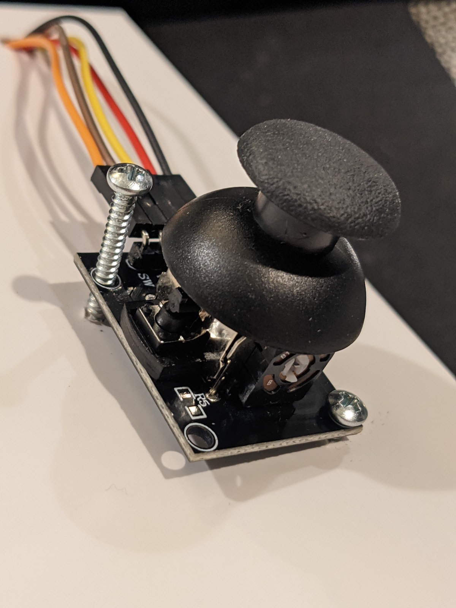

# Assignment 2: Interactive Device

### Paint time

If your school had a computer lab, chances are you have prior experience with drawing software.
Programs like MS Paint (Windows), KidPix (Mac) and Tux Paint (Linux) were the go-to software after finishing up the day's typing lesson.
Here, we recreate the janky paint software experience with a game console-style controller. 

## Assembling the Hardware

### Materials

- 1 plain, white box measuring roughly 25 x 20 x 4 cm
- ESP32
- ESP32 extension board
- breadboard
- USB cable
- Raspberry Pi
- HDMI cable (display)
- USB-C cable (power)
- USB dongle for keyboard/mouse

Joystick:
- 1 joystick
- 2 screws, approx. 2mm in diameter and 1.5cm in length
- 5 F/M jumper cables
- Gaffer tape (optional)

Buttons:
- 2 large buttons
- 8 F/M jumper cables
- 4 M/M jumper cables
- 4 10kOhm resistors
- Putty

Switch:
- 1 tiny switch
- long breadboard thing
- 1 10kOhm resistor
- 2 jumper cables

### Instructions

Mark and cut out slots for the jumper cables to go through on the top of the lid:

Put the joystick's jumper cables through the largest slot one by one. They should have enough room to lie flat if you try to push them down.

Next, take the two screws and use them to lock down the joystick. One should go on the top left, and the other on the bottom right. 
This configuration gives the joystick the most stability with two screws.

Use gaffer tape to flatten the jumper cables against the box. 
Connect the male end of the jumper cables to the joystick's assigned ESP32 pins (in this case, 12, 13, 14) and to 3.3V power/GND.

Next, we'll add the buttons. 
Put two jumper cables, female side up, through each of the four small slots on the side of the box opposite from the joystick.
Put each button's pin into the jumper cable connection, then use putty to secure the two together.
As you push the buttons back towards the lid of the box, make sure these connections stay secure.

The inside of the lid will now have eight jumpers dangling from it.

Connect these eight jumpers onto the breadboard, just as you would connect the button itself. 
Add a between the each button and 3.3V, and between each button and its pin. 
Once you add a connection to ground, you'll notice that one of the button's four ends remains unconnected.

Next, we'll add the switch. 
Put the long thing into the edge of the breadboard and place the switch in the last three pins, closest to the edge of the box.
Place a resistor between the switch's middle pin and 3.3V power. 
Connect one of the outer pins to GND, and the other to the switch's designated pin (in this case, 2).

Cut out a square from the side of the box, where the user will reach into to toggle the switch.

Finally, we'll add the Raspberry Pi and wire everything up. 
Place the Pi diagonally in the box. It might be a bit smushed against the breadboard.
Cut out slots in the side of the box for the ESP32's USB cable and the Raspberry Pi's power and HDMI cables.

You're done wiring things up!

Once you've closed the box, the outside of the enclosure is ready to be labeled and decorated.
 
