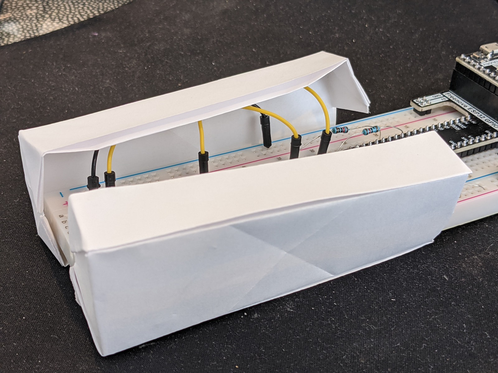

# Assignment 3: Wireless Installation 


## Assembling the Hardware

### Materials

- ESP32
- ESP32 extension board
- breadboard
- ESP32 power source
- Raspberry Pi
- HDMI cable (display)
- USB-C cable (power)
- USB dongle for keyboard/mouse

Buttons:
- 2 large buttons
- 6 M/M jumper cables
- 4 10kOhm resistors

Enclosure:
- Paper, any kind
- Tape

### Instructions

Start by wiring one of the buttons. 
Place the button so that its legs span across the centerline of the breadboard.
Connect one of the button's pins to two button pins directly across from each other to a 10kOhm resistor, and then to the 5V power line (shown in green).
Connect the pin across from it to a 10kOhm resistor, then to the ESP32's pin 12 (shown in yellow).
Connect the pin next to the output and across from the output to the ground line (shown in black).


Wire up the second button exactly the same way as the first.
Try to place the wires so that they lay as low as possible. 
This will make it easier to fit them into the enclosure.


Next, take a piece of plain letter paper and cut it in half widthwise,
so you have two equal-sized pieces.
Use the diagonal to cut each piece into a square.
Save the paper leftover for later in the building/decorating process.
Fold two thin, rectangular boxes from the square pieces.

There are many ways to fold a box. 
The method I used is similar to the one described [here](https://www.thesprucecrafts.com/easy-rectangular-origami-box-instructions-4027560). 
This one creates good structure at the ends of the box, which we need to add height.
The sides of the box are pretty flimsy, but this works well with the shape of the breadboard.


Cut half of each box's end.


Fit each box over the breadboard.
Fold the wires toward the outside of the breadboard
and tuck them into the sides of the boxes.



Now, take another piece of regular-sized paper and fold it into a large rectangular box.


Cut the box in half widthwise and fit one half over the ESP32 and breadboard. Attach it to the smaller boxes with tape.


If the boxes are too tall, you may need to add some padding at the bottom.
This is where the cutouts from previous box folding may be useful.
Fold extra paper into an accordion shape to make it take up space, as shown here on the right.
Other household paper items, like a package of gum, may also be useful to add padding.


Use the remaining cutouts to close up the top of the box.
Leave plenty of space around the buttons so that the user can clearly see them, 
while still being able to decorate around them.


Finally, cut out some space for the ESP32's cable.


The enclosure is assembled and ready for decoration.


### Installing and running the software

Install Arduino IDE on the Raspberry Pi.
Open `esp_paint/esp_paint.ino` with Arduino. 
Compile and upload it to the ESP32.

Next, you'll need to install Java (version 8) on the Raspberry Pi.
```$ sudo apt install openjdk-8-jre```
Then, download the .jar file needed to run Processing via a Python script.
```$ curl https://py.processing.org/processing.py-linux64.tgz p5.tgz```
Extract and uncompress the file you just downloaded.
```$ tar xzvf p5.tgz```

Now, change the Raspberry Pi's wi-fi connection to the ESP32 instead of a normal router.
To run the Python script for the alarm clock, you'll need to run Java with the `.jar` file in the folder you just un`tar`ed. 
It will look something like this:
```$ java -jar p5/processing-py.jar alarmclockpy/alarmclockpy.pyde```


